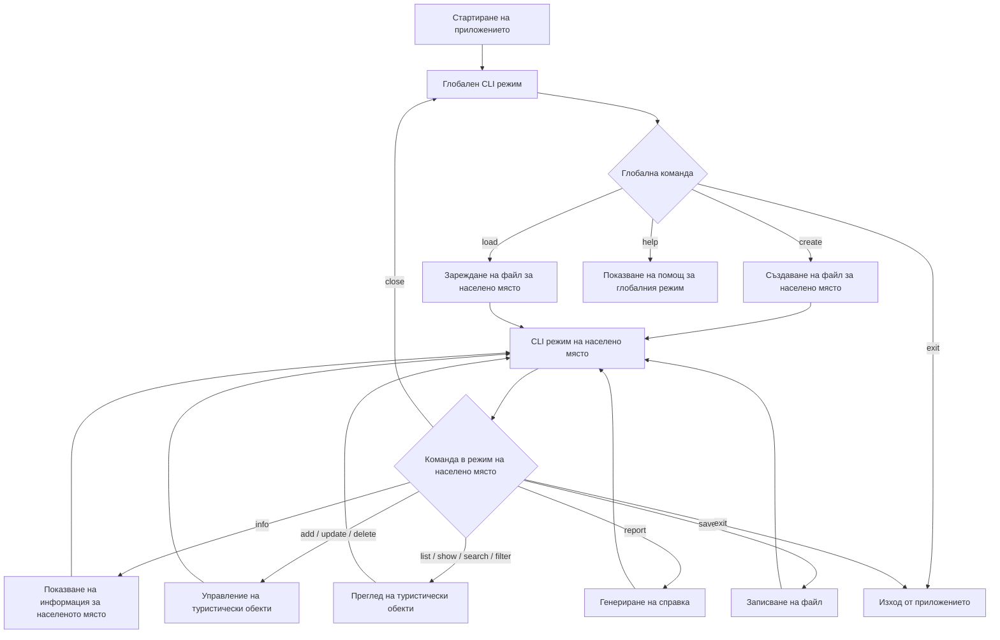
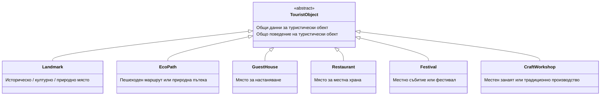
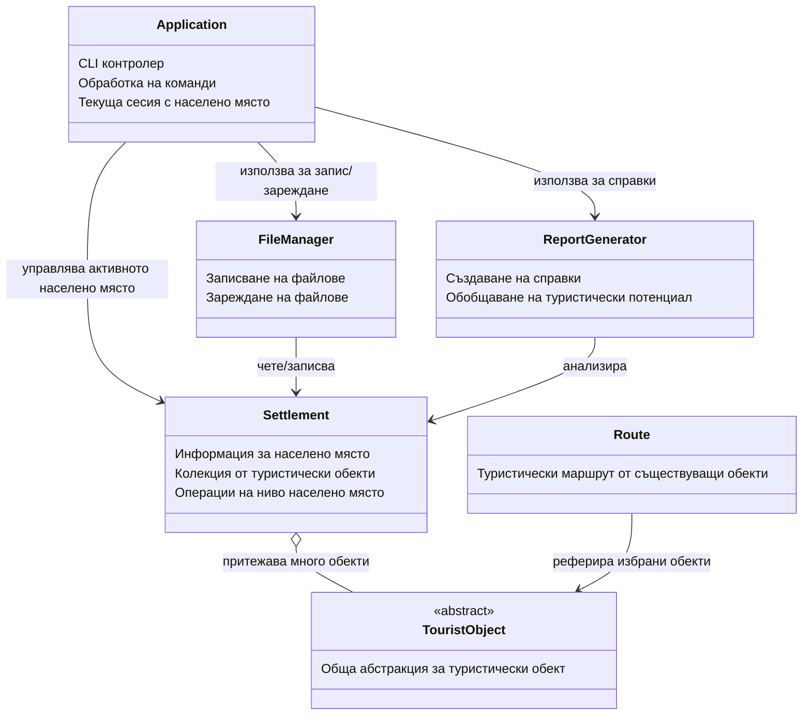
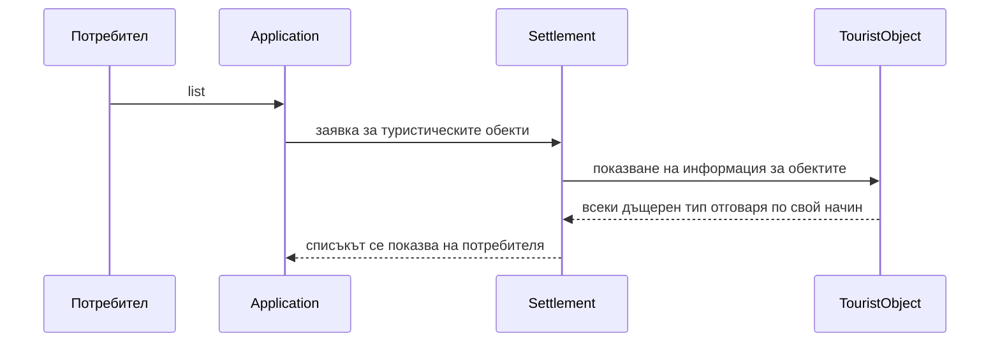
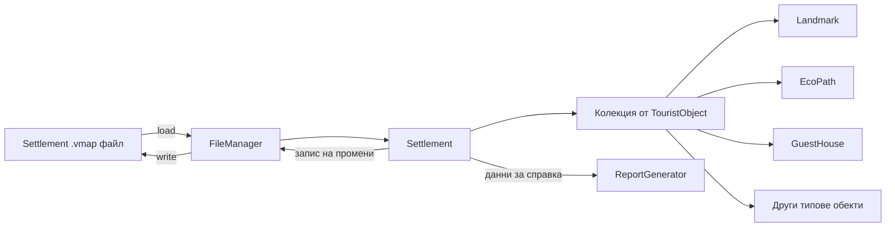

# VillageMap — Архитектура и визия за краен продукт

## 1. Обобщение на проекта

**VillageMap** е конзолно приложение на C++ за управление на туристическа информация за малки населени места в България.

Проектът е свързан с темата **„Развитие на малките населени места в България“**, като основната идея е да се създаде практичен инструмент, който представя туристическия потенциал на села и малки градове. Чрез приложението могат да се събират, съхраняват, търсят и анализират данни за забележителности, екопътеки, места за настаняване, ресторанти, фестивали и занаятчийски работилници.

Приложението работи с локални файлове за всяко населено място, вместо със сървър или база данни. В реална версия подобна система най-вероятно би комуникирала със сървър или онлайн база данни, за да зарежда и обновява информация за населените места. За целите на курсовия проект по ООП локалните файлове са практичен компромис, защото позволяват проектът да остане фокусиран върху обектно-ориентирания дизайн, C++, STL, работа с файлове и ясен CLI работен процес.

Всяко населено място се съхранява в отделен файл, например:

```text
bozhentsi.vmap
shiroka_laka.vmap
kovachevitsa.vmap
```

Всеки файл съдържа:

- обща информация за населеното място;
- туристически обекти, свързани с него;
- достатъчно данни за зареждане, редактиране, записване, търсене и генериране на справки.

Проектът е проектиран така, че да демонстрира:

- абстракция;
- капсулация;
- наследяване;
- полиморфизъм;
- композиция;
- разделяне на отговорностите;
- съхранение на данни във файлове.

---

## 2. Очакван краен продукт

Крайният продукт трябва да се държи като малък CLI инструмент, а не само като програма с номерирано меню.

Приложението има два основни режима:

1. **Глобален режим** — използва се преди да бъде заредено населено място.
2. **Режим на населено място** — използва се след създаване или зареждане на файл за населено място.

### 2.1 Глобален режим

При стартиране на приложението все още няма заредено населено място.

Пример:

```text
===== VillageMap CLI =====

Global commands:
  create <settlement_name> <file_name>
  load <file_name>
  help
  exit

>
```

Примерни команди:

```text
> create Bozhentsi bozhentsi.vmap
Created settlement 'Bozhentsi' in file 'bozhentsi.vmap'.

> load bozhentsi.vmap
Loaded settlement file 'bozhentsi.vmap'.
```

След изпълнение на `create` или `load` програмата преминава в режим на населено място.

### 2.2 Режим на населено място

Когато населено място е заредено, командният ред се променя:

```text
[Bozhentsi] >
```

Очаквани команди:

```text
info
add
list
show <id>
delete <id>
update <id>
search <name>
filter <category>
report
save
close
help
exit
```

Пример:

```text
[Bozhentsi] > list

ID | Category   | Name                    | Rating
------------------------------------------------
1  | Landmark   | Architectural Reserve   | 4.8
2  | EcoPath    | Forest Trail            | 4.4
3  | GuestHouse | Guest House Kalina      | 4.7
```

---

## 3. Основен поток на приложението

Следната диаграма показва основния потребителски поток в приложението.



---

## 4. Основна ООП идея

Най-важната ООП структура в проекта е йерархията `TouristObject`.

`TouristObject` представя общ туристически обект. Конкретните видове туристически обекти наследяват този клас и го специализират.



Целта на тази йерархия е приложението да може да съхранява и обработва различни видове туристически обекти чрез една обща абстракция.

Например едно населено място може да съдържа забележителности, екопътеки, къщи за гости, ресторанти, фестивали и занаятчийски работилници в една обща колекция. Приложението не трябва да знае точния тип на всеки обект, когато ги изброява, записва, търси или използва за генериране на справки.

---

## 5. Обща връзка между компонентите на системата

Следната диаграма показва връзката между основните части на системата.



---

## 6. Отговорности на класовете

### 6.1 `Application`

Класът `Application` управлява CLI интерфейса.

Той отговаря за:

- стартиране и спиране на програмата;
- четене на команди от потребителя;
- превключване между глобален режим и режим на населено място;
- следене кое населено място е заредено в момента;
- извикване на правилната част от програмата според въведената команда.

Този клас трябва да действа като координатор на приложението. Той не трябва да съдържа подробната логика за туристическите обекти, справките или обработката на файловете.

---

### 6.2 `Settlement`

Класът `Settlement` представя едно село или малък град.

Той съхранява:

- име;
- област или регион;
- население;
- кратко описание;
- всички туристически обекти, свързани с населеното място.

Класът трябва да управлява операции на ниво населено място, като добавяне, премахване, намиране, филтриране и изброяване на туристически обекти.

`Settlement` е централният модел от данни в приложението.

---

### 6.3 `TouristObject`

`TouristObject` е абстрактният базов клас за всички туристически атракции и услуги, свързани с туризма.

Той съхранява информацията, която всички туристически обекти имат общо, например:

- id;
- име;
- описание;
- рейтинг;
- цена или такса за достъп.

Освен това дефинира какво трябва да може да прави всеки туристически обект в системата, например:

- да определя своята категория;
- да показва кратка и подробна информация;
- да предоставя данни за записване във файл;
- да обновява собствената си специфична информация;
- да участва в справки и класации.

Това е най-важният клас за демонстриране на наследяване и полиморфизъм.

---

### 6.4 Дъщерни класове на `TouristObject`

Всеки дъщерен клас представя конкретен тип туристически обект.

| Клас | Предназначение | Примерни данни |
|---|---|---|
| `Landmark` | Културни, исторически или природни забележителности | исторически период, наличие на екскурзовод |
| `EcoPath` | Пешеходни маршрути и природни пътеки | дължина, трудност, продължителност |
| `GuestHouse` | Настаняване в населеното място | капацитет, цена на нощувка, паркинг |
| `Restaurant` | Места за местна храна | тип кухня, наличие на местни ястия |
| `Festival` | Местни събития и традиции | дата, тема, ежегодност |
| `CraftWorkshop` | Местни занаяти и традиционно производство | тип занаят, демонстрации |

Тези класове трябва да споделят общ интерфейс чрез `TouristObject`, но всеки от тях трябва да съхранява и управлява собствените си специфични данни.

---

### 6.5 `FileManager`

`FileManager` управлява входа и изхода от файлове.

Той отговаря за:

- зареждане на файлове за населени места;
- записване на файлове за населени места;
- четене на данни от файл;
- записване на данни във файл;
- възстановяване на правилните типове туристически обекти от съхранения текст.

Така обработката на файловете остава отделена от CLI интерфейса и от моделите на обектите.

---

### 6.6 `ReportGenerator`

`ReportGenerator` създава справки за дадено населено място.

Една справка може да включва:

- основна информация за населеното място;
- брой туристически обекти;
- категории обекти;
- среден рейтинг;
- оценка на туристическия потенциал;
- кратки препоръки.

Целта на този клас е логиката за справки да бъде отделена от `Settlement` и `Application`.

---

### 6.7 `Route`

`Route` представя туристически маршрут, съставен от вече съществуващи туристически обекти.

Това е опционална или по-късна функционалност.

Маршрутът може да съдържа избрани туристически обекти от дадено населено място и да ги представя като планиран маршрут за посещение. `Route` не трябва да притежава тези обекти, а само да реферира обекти, които вече съществуват в `Settlement`.

---

## 7. Полиморфизъм в проекта

Основната употреба на полиморфизъм е възможността приложението да работи с различни типове туристически обекти чрез общата абстракция `TouristObject`.

Например, когато потребителят изброява всички туристически обекти, населеното място може да съдържа смес от забележителности, екопътеки, къщи за гости, ресторанти, фестивали и занаятчийски работилници. Приложението пак може да поиска от всеки обект да покаже информация за себе си, без да знае точния му конкретен тип.



Това е практическата причина да се използва абстрактен базов клас, вместо всичко да се съхранява като обикновен текст или като една голяма структура.

---

## 8. Съхранение на данните във файлове

Всяко населено място се записва в отделен `.vmap` файл.

Примерен файл:

```text
SETTLEMENT|Bozhentsi|Gabrovo|105|Historical village with traditional Bulgarian architecture.
LANDMARK|1|Architectural Reserve|Historical village with traditional houses.|4.8|0|Bulgarian Revival|1
ECOPATH|2|Forest Trail|Short nature route near the village.|4.4|0|3.5|2|90
GUESTHOUSE|3|Guest House Kalina|Family guest house.|4.7|60|12|60|1
```

Точният формат може да бъде променен по време на разработката, но трябва да остане прост, четим и лесен за обработка със стандартни C++ средства.

Текстовият файлов формат е достатъчен за проекта, защото целта не е да се изгради база данни, а да се демонстрират съхранение на данни и възстановяване на обекти.

---

## 9. Поток на данните

Следната диаграма показва как данните се движат между файловете и обектите по време на изпълнение.



---

## 10. Препоръчителна файлова структура на проекта

```text
VillageMap/
│
├── CMakeLists.txt
├── README.md
├── .gitignore
├── .clang-format
├── .editorconfig
│
├── docs/
│   ├── architecture.md
│   ├── implementation_plan.md
│   └── main_idea.md
│
├── data/
│   └── sample_data.vmap
│
└── src/
    ├── main.cpp
    ├── Application.h
    ├── Application.cpp
    │
    ├── TouristObject.h
    ├── TouristObject.cpp
    ├── Landmark.h
    ├── Landmark.cpp
    ├── EcoPath.h
    ├── EcoPath.cpp
    ├── GuestHouse.h
    ├── GuestHouse.cpp
    ├── Restaurant.h
    ├── Restaurant.cpp
    ├── Festival.h
    ├── Festival.cpp
    ├── CraftWorkshop.h
    ├── CraftWorkshop.cpp
    │
    ├── Settlement.h
    ├── Settlement.cpp
    ├── FileManager.h
    ├── FileManager.cpp
    ├── ReportGenerator.h
    ├── ReportGenerator.cpp
    ├── Route.h
    └── Route.cpp
```

---

## 11. Минимална работеща версия

Минималната работеща версия трябва да включва:

- глобален CLI режим;
- CLI режим на населено място;
- създаване на файл за населено място;
- зареждане на файл за населено място;
- записване на файл за населено място;
- модел на населено място;
- абстрактен модел на туристически обект;
- поне три вида туристически обекти:
  - `Landmark`;
  - `EcoPath`;
  - `GuestHouse`;
- добавяне на туристически обекти;
- изброяване на туристически обекти;
- показване на подробности за един туристически обект;
- изтриване на туристически обекти.

Тази версия е достатъчна, за да демонстрира основната ООП архитектура и основната цел на приложението.

---

## 12. Пълна финална версия

Пълната версия трябва да включва:

- всички функционалности от минималната версия;
- всички планирани типове туристически обекти:
  - `Landmark`;
  - `EcoPath`;
  - `GuestHouse`;
  - `Restaurant`;
  - `Festival`;
  - `CraftWorkshop`;
- редактиране на съществуващи обекти;
- търсене по име;
- филтриране по категория;
- генериране на туристическа справка;
- изчисляване на базов туристически потенциал;
- опционално създаване на туристически маршрути;
- примерни файлове с данни;
- проектна документация;
- диаграми за обяснение и презентация.

---

## 13. Примерна финална CLI сесия

```text
===== VillageMap CLI =====

Global commands:
  create <settlement_name> <file_name>
  load <file_name>
  help
  exit

> create Bozhentsi bozhentsi.vmap

Enter region: Gabrovo
Enter population: 105
Enter description: Historical village with traditional Bulgarian architecture.

Created settlement 'Bozhentsi' in file 'bozhentsi.vmap'.

[Bozhentsi] > add

Choose tourist object type:
1. Landmark
2. EcoPath
3. GuestHouse
4. Restaurant
5. Festival
6. CraftWorkshop

Choice: 1
Name: Architectural Reserve
Description: Historical village with traditional houses.
Rating: 4.8
Price: 0
Historical period: Bulgarian Revival
Has guide: 1

Tourist object added successfully.

[Bozhentsi] > list

ID | Category | Name                  | Rating
-----------------------------------------------
1  | Landmark | Architectural Reserve | 4.8

[Bozhentsi] > report

Tourism report for: Bozhentsi
Region: Gabrovo
Population: 105

Number of tourist objects: 1
Average rating: 4.8
Tourism potential score: 9.6

Recommendations:
- Promote local landmarks.
- Add more accommodation options.
- Develop eco and cultural routes.

[Bozhentsi] > save
File saved successfully.

[Bozhentsi] > close
Settlement closed.

> exit
```

---

## 14. Защо тази архитектура отговаря на изискванията на курса

Тази архитектура е подходяща за курс по ООП, защото ясно демонстрира:

- абстрактен базов клас;
- няколко дъщерни класа;
- полиморфизъм чрез общ базов тип;
- притежание на обекти чрез модела `Settlement`;
- разделение между CLI интерфейс, работа с файлове, справки и модели на данни;
- съхранение на данни във файлове;
- реалистична структура на C++ проект.

Проектът остава изцяло на C++ и не изисква сървъри, бази данни, графичен интерфейс или външни библиотеки.

---

## 15. Връзка с темата „Развитие на малките населени места в България“

Проектът подпомага развитието на малките населени места, като предлага начин техните туристически ресурси да бъдат описани, организирани и представени по структуриран начин.

Много села и малки градове имат културни, природни и исторически предимства, но често те не са достатъчно добре представени в дигитална форма. VillageMap решава този проблем чрез модел, в който всяко населено място може да има собствен профил, туристически обекти, справки и препоръки.

Приложението е актуално, защото туризмът, местните занаяти, природните маршрути и културните събития могат да създадат икономическа активност в малките населени места. Дори като учебен CLI проект, VillageMap показва как една по-голяма реална система би могла да подпомага популяризирането на такива места.

---

## 16. Име и мото на екипа

Примерно име на екипа:

```text
Team RevivalMap
```

Примерно мото:

```text
„Малките места имат големи истории.“
```

Други възможни варианти:

| Име на екип | Мото |
|---|---|
| `Village Vision` | „Откриваме потенциала на забравените места.“ |
| `Rural Roots` | „Пазим корените, развиваме бъдещето.“ |
| `Bulgaria Beyond Cities` | „България не свършва с големите градове.“ |
| `Small Places, Big Future` | „Малко място, голяма възможност.“ |

---

## 17. Бъдещи подобрения

Тези функционалности не са задължителни за курсовата версия, но могат да бъдат споменати по време на презентацията:

- сървърна база данни;
- уеб интерфейс;
- интеграция с карта;
- снимки за туристическите обекти;
- потребителски оценки и ревюта;
- оптимизация на маршрути;
- многоезична поддръжка;
- мобилно приложение;
- връзка със сайтове на общини.

Това са само бъдещи идеи. Текущата реализация остава фокусирана върху C++ и ООП.
