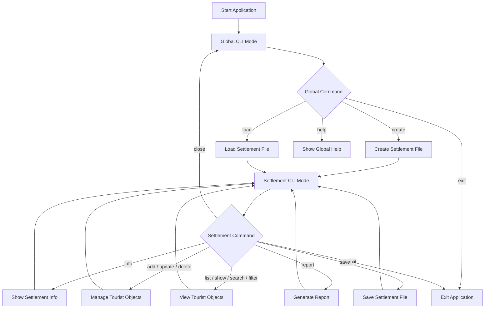
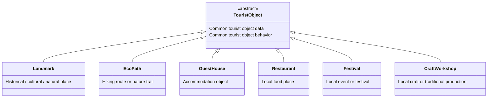
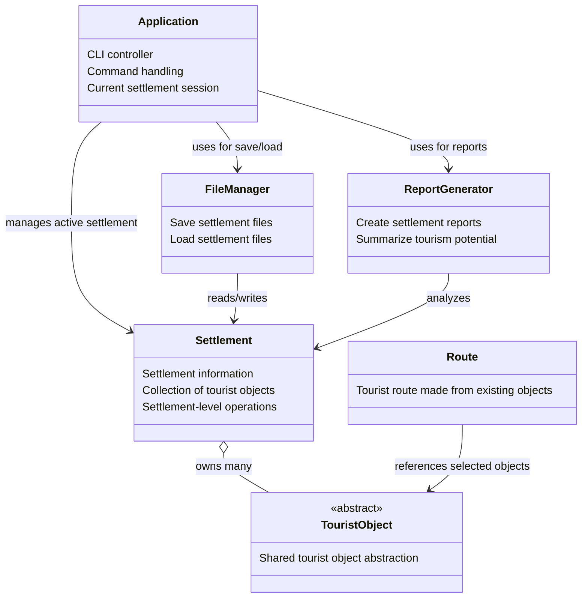
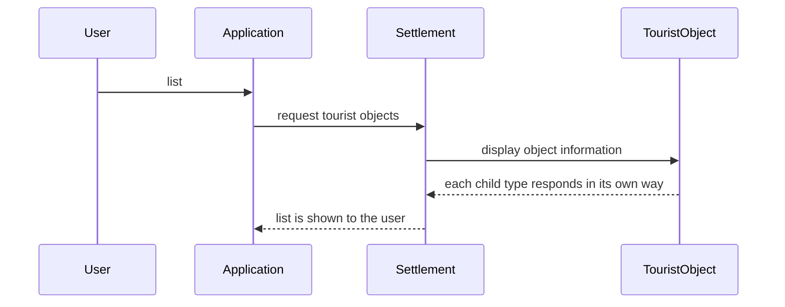
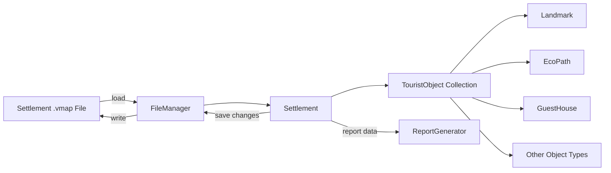

# VillageMap — Architecture and Final Product Vision

## 1. Project Summary

**VillageMap** is a pure C++ command-line application for managing tourist information about small settlements in Bulgaria.

The application works with local settlement files instead of a server or database. In a real-world version, this type of system would most likely communicate with a server or online database to retrieve and update village data. For this OOP course project, local files are used as a practical compromise. This keeps the project focused on object-oriented design, C++, STL, file handling, and a clear CLI workflow.

Each settlement is stored in its own file, for example:

```text
bozhentsi.vmap
shiroka_laka.vmap
kovachevitsa.vmap
```

Each file contains:

- general information about the settlement;
- tourist objects connected to that settlement;
- enough data to load, edit, save, search, and generate reports.

The project is designed to demonstrate:

- abstraction;
- encapsulation;
- inheritance;
- polymorphism;
- composition;
- separation of responsibilities;
- file-based persistence.

---

## 2. Expected Final Product

The final product should behave like a small CLI tool, not just a numbered menu program.

The application has two main modes:

1. **Global mode** — used before a settlement is loaded.
2. **Settlement mode** — used after a settlement file is created or loaded.

### 2.1 Global Mode

When the application starts, no settlement is loaded yet.

Example:

```text
===== VillageMap CLI =====

Global commands:
  create <settlement_name> <file_name>
  load <file_name>
  help
  exit

>
```

Example commands:

```text
> create Bozhentsi bozhentsi.vmap
Created settlement 'Bozhentsi' in file 'bozhentsi.vmap'.

> load bozhentsi.vmap
Loaded settlement file 'bozhentsi.vmap'.
```

After `create` or `load`, the program enters settlement mode.

### 2.2 Settlement Mode

When a settlement is loaded, the prompt changes:

```text
[Bozhentsi] >
```

Expected commands:

```text
info
add
list
show <id>
delete <id>
update <id>
search <name>
filter <category>
report
save
close
help
exit
```

Example:

```text
[Bozhentsi] > list

ID | Category   | Name                    | Rating
------------------------------------------------
1  | Landmark   | Architectural Reserve   | 4.8
2  | EcoPath    | Forest Trail            | 4.4
3  | GuestHouse | Guest House Kalina      | 4.7
```

---

## 3. High-Level Application Flow

This diagram shows the main user flow through the application.



---

## 4. Main OOP Idea

The most important OOP structure in the project is the `TouristObject` hierarchy.

`TouristObject` represents a general tourist object. Specific object types inherit from it and specialize it.



The purpose of this hierarchy is to let the application store and process different tourist object types through one common abstraction.

For example, a settlement can contain landmarks, eco paths, guest houses, restaurants, festivals, and craft workshops in the same collection. The application does not need to know the exact type of every object when listing, saving, searching, or generating reports.

---

## 5. Full System Relationship

This diagram shows the relationship between the main parts of the system.



---

## 6. Class Responsibilities

### 6.1 `Application`

The `Application` class controls the CLI interface.

It is responsible for:

- starting and stopping the program;
- reading commands from the user;
- switching between global mode and settlement mode;
- keeping track of the currently loaded settlement;
- calling the correct part of the program depending on the command.

This class should act as the coordinator of the application. It should not contain the detailed logic of tourist objects, reports, or file parsing.

---

### 6.2 `Settlement`

The `Settlement` class represents one village or small town.

It is responsible for storing:

- name;
- region;
- population;
- short description;
- all tourist objects connected to the settlement.

It should also handle settlement-level operations, such as adding, removing, finding, filtering, and listing tourist objects.

The settlement is the central data model of the application.

---

### 6.3 `TouristObject`

`TouristObject` is the abstract base class for all tourist attractions and tourism-related services.

It stores the information that all tourist objects have in common, such as:

- id;
- name;
- description;
- rating;
- price or access cost.

It also defines what every tourist object must be able to do in the system, such as:

- identify its category;
- display short and detailed information;
- provide data for saving to a file;
- update its own specific information;
- participate in reports and ranking.

This is the most important class for demonstrating inheritance and polymorphism.

---

### 6.4 Tourist Object Child Classes

Each child class represents a specific type of tourist object.

| Class | Purpose | Example Data |
|---|---|---|
| `Landmark` | Cultural, historical, or natural sights | historical period, guide availability |
| `EcoPath` | Hiking routes and nature trails | length, difficulty, duration |
| `GuestHouse` | Accommodation in the settlement | capacity, price per night, parking |
| `Restaurant` | Local food places | cuisine type, local food availability |
| `Festival` | Local events and traditions | date, theme, annual status |
| `CraftWorkshop` | Local crafts and traditional production | craft type, demonstrations |

These classes should share the same general interface through `TouristObject`, but each one should store and manage its own specific details.

---

### 6.5 `FileManager`

`FileManager` handles file input and output.

It is responsible for:

- loading settlement files;
- saving settlement files;
- reading file data;
- writing file data;
- recreating the correct tourist object types from stored text.

This keeps file handling separate from the CLI and from the object model.

---

### 6.6 `ReportGenerator`

`ReportGenerator` creates reports about a settlement.

A report can include:

- basic settlement information;
- number of tourist objects;
- object categories;
- average rating;
- tourism potential;
- simple recommendations.

The purpose of this class is to keep reporting logic separate from the settlement and application classes.

---

### 6.7 `Route`

`Route` represents a tourist route made from already existing tourist objects.

This is an optional or later-stage feature.

A route can contain selected tourist objects from a settlement and present them as a planned visit route. The route should not own these objects; it should only reference objects that already exist inside the settlement.

---

## 7. Polymorphism in the Project

The main use of polymorphism is that the application can work with different tourist object types through the shared `TouristObject` abstraction.

For example, when the user lists all tourist objects, the settlement may contain a mix of landmarks, eco paths, guest houses, restaurants, festivals, and craft workshops. The application can still ask each object to display itself without knowing its exact type.



This is the practical reason for using an abstract base class instead of storing everything as plain text or as one large structure.

---

## 8. File-Based Data Storage

Each settlement is saved in a separate `.vmap` file.

Example file:

```text
SETTLEMENT|Bozhentsi|Gabrovo|105|Historical village with traditional Bulgarian architecture.
LANDMARK|1|Architectural Reserve|Historical village with traditional houses.|4.8|0|Bulgarian Revival|1
ECOPATH|2|Forest Trail|Short nature route near the village.|4.4|0|3.5|2|90
GUESTHOUSE|3|Guest House Kalina|Family guest house.|4.7|60|12|60|1
```

The exact format can be adjusted during implementation, but it should remain simple, readable, and easy to parse with standard C++ tools.

A text-based file format is enough for the project because the goal is not to build a database, but to demonstrate persistence and object reconstruction.

---

## 9. Data Flow

This diagram shows how data moves between files and runtime objects.



---

## 10. Recommended Project File Structure

```text
VillageMap/
│
├── CMakeLists.txt
├── README.md
├── .gitignore
├── .clang-format
├── .editorconfig
│
├── docs/
│   ├── architecture.md
│   ├── implementation_plan.md
│   └── main_idea.md
│
├── data/
│   └── sample_data.vmap
│
└── src/
    ├── main.cpp
    ├── Application.h
    ├── Application.cpp
    │
    ├── TouristObject.h
    ├── TouristObject.cpp
    ├── Landmark.h
    ├── Landmark.cpp
    ├── EcoPath.h
    ├── EcoPath.cpp
    ├── GuestHouse.h
    ├── GuestHouse.cpp
    ├── Restaurant.h
    ├── Restaurant.cpp
    ├── Festival.h
    ├── Festival.cpp
    ├── CraftWorkshop.h
    ├── CraftWorkshop.cpp
    │
    ├── Settlement.h
    ├── Settlement.cpp
    ├── FileManager.h
    ├── FileManager.cpp
    ├── ReportGenerator.h
    ├── ReportGenerator.cpp
    ├── Route.h
    └── Route.cpp
```

---

## 11. Minimum Working Version

The minimum working version should include:

- global CLI mode;
- settlement CLI mode;
- creating a settlement file;
- loading a settlement file;
- saving a settlement file;
- a settlement model;
- an abstract tourist object model;
- at least three tourist object types:
  - `Landmark`;
  - `EcoPath`;
  - `GuestHouse`;
- adding tourist objects;
- listing tourist objects;
- showing details for one tourist object;
- deleting tourist objects.

This version is enough to demonstrate the core OOP architecture and the basic purpose of the application.

---

## 12. Full Final Version

The full version should include:

- all minimum version features;
- all planned tourist object types:
  - `Landmark`;
  - `EcoPath`;
  - `GuestHouse`;
  - `Restaurant`;
  - `Festival`;
  - `CraftWorkshop`;
- updating existing objects;
- searching by name;
- filtering by category;
- generating a tourism report;
- calculating basic tourism potential;
- optional tourist route creation;
- sample data files;
- project documentation;
- diagrams for explanation and presentation.

---

## 13. Example Final CLI Session

```text
===== VillageMap CLI =====

Global commands:
  create <settlement_name> <file_name>
  load <file_name>
  help
  exit

> create Bozhentsi bozhentsi.vmap

Enter region: Gabrovo
Enter population: 105
Enter description: Historical village with traditional Bulgarian architecture.

Created settlement 'Bozhentsi' in file 'bozhentsi.vmap'.

[Bozhentsi] > add

Choose tourist object type:
1. Landmark
2. EcoPath
3. GuestHouse
4. Restaurant
5. Festival
6. CraftWorkshop

Choice: 1
Name: Architectural Reserve
Description: Historical village with traditional houses.
Rating: 4.8
Price: 0
Historical period: Bulgarian Revival
Has guide: 1

Tourist object added successfully.

[Bozhentsi] > list

ID | Category | Name                  | Rating
-----------------------------------------------
1  | Landmark | Architectural Reserve | 4.8

[Bozhentsi] > report

Tourism report for: Bozhentsi
Region: Gabrovo
Population: 105

Number of tourist objects: 1
Average rating: 4.8
Tourism potential score: 9.6

Recommendations:
- Promote local landmarks.
- Add more accommodation options.
- Develop eco and cultural routes.

[Bozhentsi] > save
File saved successfully.

[Bozhentsi] > close
Settlement closed.

> exit
```

---

## 14. Why This Architecture Fits the Course

This architecture is suitable for an OOP course because it clearly demonstrates:

- an abstract base class;
- multiple child classes;
- polymorphism through a shared base type;
- object ownership through the settlement model;
- separation between CLI, file handling, reporting, and data models;
- file-based persistence;
- realistic project structure.

The project remains pure C++ and does not require servers, databases, graphics, or external libraries.

---

## 15. Future Improvements

These features are not required for the course version, but can be mentioned during the presentation:

- server-based database;
- web interface;
- map integration;
- photos for tourist objects;
- user reviews;
- route optimization;
- multilingual support;
- mobile application;
- connection with municipality websites.

These are future ideas only. The current implementation stays focused on C++ and OOP.

